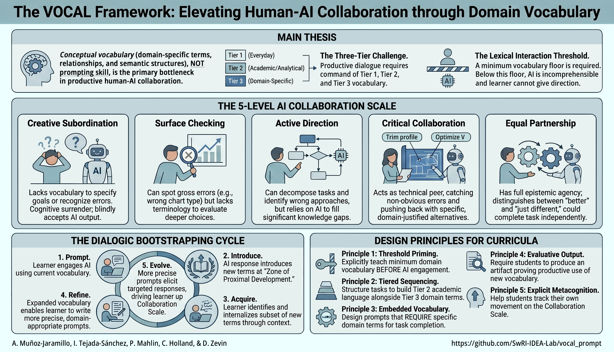

# VOCAL Prompts — Dialogic Bootstrapping Session Prompts

*[Versión en español](#prompts-vocal--prompts-de-sesión-para-bootstrapping-dialógico)*

This repository contains runtime system prompts that implement the **VOCAL Framework** (*Vocabulary-Oriented Collaboration with AI for Learning*), introduced in:

> Muñoz-Jaramillo, A., Tejada-Sánchez, I., Mahlin, P., Holland, C., & Zevin, D. (2026). *The VOCAL Framework: Vocabulary-Oriented Collaboration with AI for Learning in STEAM Education.*

---

## The idea behind these prompts

The VOCAL Framework argues that **conceptual vocabulary — not prompting technique — is the primary bottleneck in productive human-AI collaboration**. A learner who lacks the domain-specific terms to describe what they need cannot be helped by prompting tips alone; the gap is linguistic, not technical.

The prompts operationalize a mechanism called **dialogic bootstrapping**: a positive feedback loop in which iterative AI dialogue builds the vocabulary needed for progressively more effective prompting. Each exchange should leave the learner better equipped to ask the next question.

By default, general-purpose LLMs work *against* this process: they silently translate vague language into precise vocabulary, decompose problems on the learner's behalf, and accept "looks good" as task completion — all of which short-circuit vocabulary acquisition. These prompts install specific countermeasures:

- A **calibration probe** at session opening that estimates the learner's domain level from behavioral evidence, overriding self-reported expertise.
- A **three-phase interaction cycle** (engage → introduce → produce) that separates the introduction of new terms from their evaluative use, preventing the learner from skipping productive engagement.
- **Anchor term persistence**: a term identified as the learner's next growth edge is tracked across cycles and woven into subsequent questioning until the learner deploys it correctly.
- **Suppressed default behaviors**: the prompts explicitly prohibit silent vocabulary translation, unprompted problem decomposition, and accepting output without explanation in domain terms.

Progress is tracked against a **five-level AI Collaboration Scale**, from Level 1 (*creative subordination* — vague goals, no evaluative capacity) to Level 5 (*equal partnership* — full technical direction, nuanced evaluation). The scale is domain-relative: a learner may be at Level 4 in Python and Level 1 in solar physics within the same session.

---

## Available prompts

| Language | Prompt |
|---|---|
| English | [VOCAL\_prompt\_implementing\_dialogic\_bootstrapping\_EN.md](VOCAL_prompts/VOCAL_prompt_implementing_dialogic_bootstrapping_EN.md) |
| Español | [VOCAL\_prompt\_implementando\_bootstrapping\_dialogico\_ES.md](VOCAL_prompts/VOCAL_prompt_implementando_bootstrapping_dialogico_ES.md) |

---

## How to use

1. **Open the prompt file** for your preferred language.

2. **Fill in the SESSION CONTEXT** at the top of the file:
   - `Session length` — estimated time available (e.g., `45 minutes`).
   - `Topic` — the subject or task the learner will work on, in their own words.
   - `Goal type` — one of: *understand a concept*, *get a task done*, or *explore a topic broadly*.

3. **Leave the OPTIONAL SESSION CONTEXT blank if unsure.** An empty field is better than a guess. The AI will infer defaults from the calibration probe.

4. **Paste the entire document** — including the filled-in SESSION CONTEXT — into the system prompt or at the start of a new conversation with your LLM of choice, followed immediately by the learner's first question or task.

5. **Let the session run.** The prompt manages the interaction structure from there: it will open with a calibration probe, introduce vocabulary in context, require the learner to produce vocabulary before moving forward, and close cycles with explicit reflection on vocabulary gains.

### A note on the OPTIONAL SESSION CONTEXT

The optional fields are primarily designed for **educators deploying these prompts in a structured course or program**:

- `Primary domain` and `Adjacent domains` focus the calibration and vocabulary selection on the specific disciplinary context of the lesson.
- `Vocabulary already introduced in prior sessions` allows the AI to treat previously learned terms as known anchors, picking up where the last session left off rather than re-introducing familiar vocabulary.
- `Target collaboration level` communicates the educator's pedagogical goal for the session. **This does not set the AI's working level** — the calibration probe does — but it tells the AI which level to aim toward as the session's ceiling.

If you are using these prompts outside a formal curriculum (e.g., self-directed learning or professional upskilling), the required SESSION CONTEXT fields are sufficient to get started.

---

## Contributing

We welcome discussion, suggested modifications, and new prompts with specific pedagogical objectives. These prompts are actively tested and revised as part of the ButterflAI program — an 11-week undergraduate research experience in solar physics built around the VOCAL Framework. Open an issue or pull request to contribute.

## Acknowledgements

The ButterflAI program is part of [NASA's Consequences Of Fields and Flows in the Interior and Exterior of the Sun](https://coffies.stanford.edu/) (COFFIES) Science center.  This work was supported by the COFFIES DSC Cooperative Agreement 80NSSC22M0162.

---

# PROMPTS VOCAL — Prompts de Sesión para Bootstrapping Dialógico

*[English version](#vocal-prompts--dialogic-bootstrapping-session-prompts)*

Este repositorio contiene prompts de sistema que implementan el **Marco conceptual VOCAL** (*Vocabulary-Oriented Collaboration with AI for Learning* — Colaboración con IA orientada al aprendizaje de vocabulario), introducido en:

> Muñoz-Jaramillo, A., Tejada-Sánchez, I., Mahlin, P., Holland, C., & Zevin, D. (2026). *The VOCAL Framework: Vocabulary-Oriented Collaboration with AI for Learning in STEAM Education.*

---

## La idea detrás de estos prompts

El Marco VOCAL propone que **el vocabulario conceptual — no la técnica de prompting — es el principal limitante en la colaboración productiva con IA**. Un usuario que carece de los términos específicos, usados en un campo del conocimiento para describir lo que se necesita, no puede ser ayudado con guías de prompting; la brecha es lingüística, no técnica.

Los prompts operacionalizan un mecanismo llamado **bootstrapping dialógico**: un ciclo de retroalimentación positiva en el que el diálogo iterativo con la IA construye el vocabulario necesario para un prompting progresivamente más efectivo. El objetivo es que cada intercambio deje al usuario mejor equipado para formular la siguiente pregunta.

Los LLMs de propósito general trabajan, por defecto, *en contra* de este proceso: traducen silenciosamente el lenguaje cotidiano a vocabulario preciso, descomponen los problemas en nombre del usuario y aceptan "parece bien" como una tarea completada — todo lo cual evita la adquisición de vocabulario. Estos prompts instalan varias medidas específicas para evitar esto:

- Una **evaluacion de calibración** al inicio de la sesión estima el nivel del aprendiz a partir de evidencia conductual, invalidando la experiencia autodeclarada.
- Un **ciclo de interacción en tres fases** (sondear → introducir → producir) que separa la introducción de nuevos términos de su uso evaluativo, evitando que el aprendiz omita el compromiso productivo.
- **Persistencia del término ancla**: un término identificado como el siguiente punto de crecimiento del aprendiz es rastreado entre ciclos e incorporado al cuestionamiento posterior hasta que el aprendiz lo despliegue correctamente.
- **Comportamientos suprimidos**: los prompts prohíben explícitamente la traducción silenciosa de vocabulario, la descomposición de problemas sin requerir participación del usuario, y aceptar resultados sin explicación en términos del campo de conocimiento.

El progreso se rastrea en una **Escala de Colaboración con IA de cinco niveles**, yendo desde un Nivel 1 (*subordinación creativa* — objetivos vagos, sin capacidad evaluativa) hasta un Nivel 5 (*sociedad igualitaria* — dirección técnica completa, evaluación matizada). La escala es relativa al campo de conocimiento: un aprendiz puede estar en Nivel 4 en Python y Nivel 1 en física solar dentro de la misma sesión.

---

## Prompts disponibles

| Idioma | Prompt |
|---|---|
| English | [VOCAL\_prompt\_implementing\_dialogic\_bootstrapping\_EN.md](VOCAL_prompts/VOCAL_prompt_implementing_dialogic_bootstrapping_EN.md) |
| Español | [VOCAL\_prompt\_implementando\_bootstrapping\_dialogico\_ES.md](VOCAL_prompts/VOCAL_prompt_implementando_bootstrapping_dialogico_ES.md) |

---

## Cómo usar

1. **Abre el archivo del prompt** en tu idioma preferido.

2. **Completa el CONTEXTO DE SESIÓN** al inicio del archivo:
   - `Duración de la sesión` — tiempo disponible estimado (ej., `45 minutos`).
   - `Tema` — el tema o tarea en que trabajará el aprendiz, en sus propias palabras.
   - `Tipo de objetivo` — uno de: *entender un concepto*, *completar una tarea*, o *explorar un tema ampliamente*.

3. **Deja el CONTEXTO DE SESIÓN OPCIONAL en blanco si no estás seguro.** Un campo vacío es mejor que una entrada incorrecta. La IA inferirá los valores por defecto a partir de la sonda de calibración.

4. **Pega el documento completo** — incluyendo el CONTEXTO DE SESIÓN completado — en el prompt de sistema o al inicio de una nueva conversación con el LLM de tu elección, seguido inmediatamente por la primera pregunta o tarea del aprendiz.

5. **Deja que la sesión avance.** El prompt gestiona la estructura de la interacción desde ese punto: abrirá con una sonda de calibración, introducirá vocabulario en contexto, requerirá que el aprendiz produzca vocabulario antes de continuar y cerrará los ciclos con reflexión explícita sobre las ganancias de vocabulario.

### Una nota sobre el CONTEXTO DE SESIÓN OPCIONAL

Los campos opcionales están diseñados principalmente para **educadores que despliegan estos prompts en un curso o programa estructurado**:

- `Dominio principal` y `Dominios adyacentes` enfocan la calibración y la selección de vocabulario en el contexto disciplinario específico de la lección.
- `Vocabulario ya introducido en sesiones anteriores` permite a la IA tratar los términos aprendidos previamente como anclas conocidas, retomando donde terminó la última sesión en lugar de reintroducir vocabulario familiar.
- `Nivel de colaboración objetivo` comunica la meta pedagógica del educador para la sesión. **Esto no establece el nivel de trabajo de la IA** — la sonda de calibración lo hace — sino que le indica a qué nivel apuntar como techo de la sesión.

Si usas estos prompts fuera de un currículo formal (ej., aprendizaje autodirigido o actualización profesional), los campos requeridos del CONTEXTO DE SESIÓN son suficientes para comenzar.

---

## Contribuciones

Damos la bienvenida a discusiones, modificaciones sugeridas y nuevos prompts con objetivos pedagógicos específicos. Estos prompts los vamos a probar, evaluar, y revisar activamente como parte del programa ButterflAI — nuestra experiencia de investigación universitaria de 11 semanas en física solar construida alrededor del Marco VOCAL. Abre un issue o pull request para contribuir.

## Agradecimientos

El programa ButterflAI forma parte del centro de ciencias [COFFIES (Consequences Of Fields and Flows in the Interior and Exterior of the Sun)](https://coffies.stanford.edu/) de la NASA. Este trabajo fue financiado por el Acuerdo Cooperativo COFFIES DSC 80NSSC22M0162.
